### Escuela Colombiana de Ingeniería
### Arquitecturas de Software - ARSW

## Escalamiento en Azure con Maquinas Virtuales, Sacale Sets y Service Plans

### Dependencias
* Cree una cuenta gratuita dentro de Azure. Para hacerlo puede guiarse de esta [documentación](https://azure.microsoft.com/es-es/free/students/). Al hacerlo usted contará con $100 USD para gastar durante 12 meses.

### Parte 0 - Entendiendo el escenario de calidad

Adjunto a este laboratorio usted podrá encontrar una aplicación totalmente desarrollada que tiene como objetivo calcular el enésimo valor de la secuencia de Fibonnaci.

**Escalabilidad**
Cuando un conjunto de usuarios consulta un enésimo número (superior a 1000000) de la secuencia de Fibonacci de forma concurrente y el sistema se encuentra bajo condiciones normales de operación, todas las peticiones deben ser respondidas y el consumo de CPU del sistema no puede superar el 70%.

### Parte 1 - Escalabilidad vertical

1. Diríjase a el [Portal de Azure](https://portal.azure.com/) y a continuación cree una maquina virtual con las características básicas descritas en la imágen 1 y que corresponden a las siguientes:
    * Resource Group = SCALABILITY_LAB
    * Virtual machine name = VERTICAL-SCALABILITY
    * Image = Ubuntu Server 
    * Size = Standard B1ls
    * Username = scalability_lab
    * SSH publi key = Su llave ssh publica


Para iniciar el proceso, nos dirigimos al portal de Azure, accedimos a la sección de Virtual Machines y procedimos a crear una nueva instancia.


Luego configuramos la máquina virtual estableciendo las características que se nos habían indicado.

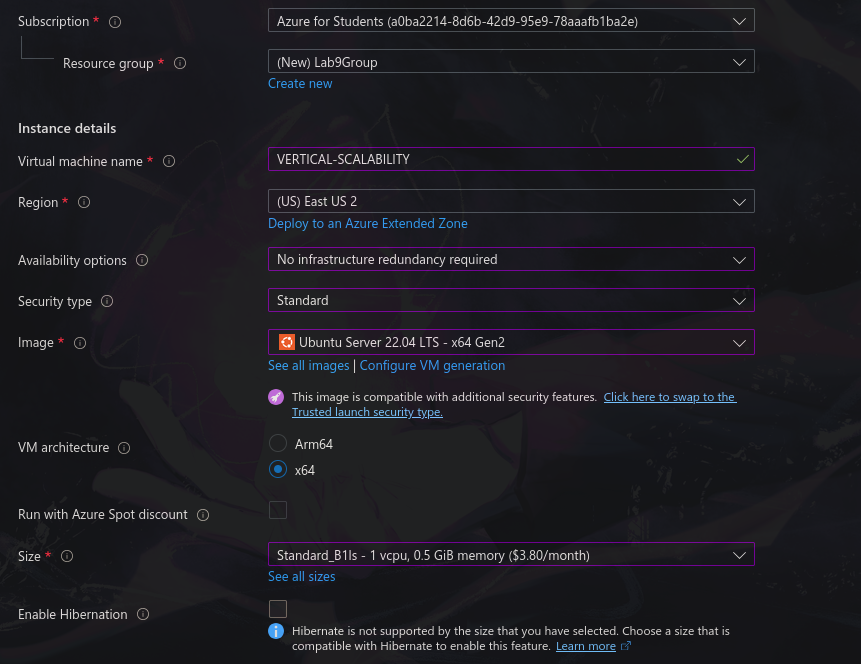

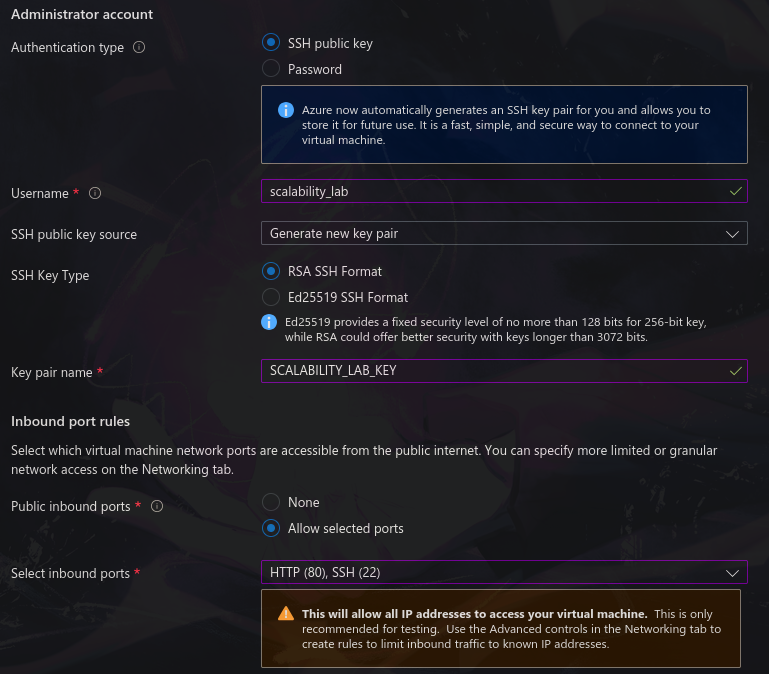

2. Para conectarse a la VM use el siguiente comando, donde las `x` las debe remplazar por la IP de su propia VM (Revise la sección "Connect" de la virtual machine creada para tener una guía más detallada).

    `ssh scalability_lab@xxx.xxx.xxx.xxx`

Antes de conectarnos, verificamos la dirección IP pública de la máquina en Azure y en nuestro caso, esta correspondía a 172.172.37.63
Usamos el comando en la terminal añadiendo la opción `-i` para que leyera nuestra llave SSH y nos permitiera acceder a la máquina.


3. Instale node, para ello siga la sección *Installing Node.js and npm using NVM* que encontrará en este [enlace](https://linuxize.com/post/how-to-install-node-js-on-ubuntu-18.04/).

Habilitamos el repositorio de NodeSource ejecutando el comando `curl -sL https://deb.nodesource.com/setup_12.x | sudo -E bash -`.

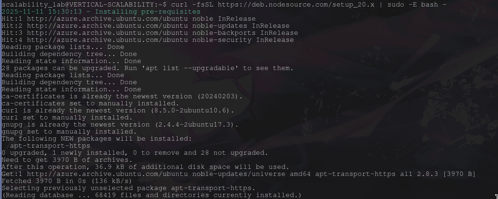

Una vez habilitado el repositorio de NodeSource, instalamos Node.js y npm ejecutando `sudo apt install nodejs`.


4. Para instalar la aplicación adjunta al Laboratorio, suba la carpeta `FibonacciApp` a un repositorio al cual tenga acceso y ejecute estos comandos dentro de la VM:

    `git clone <your_repo>`

    `cd <your_repo>/FibonacciApp`

    `npm install`

Ejecutamos los tres comandos para instalar la aplicación.


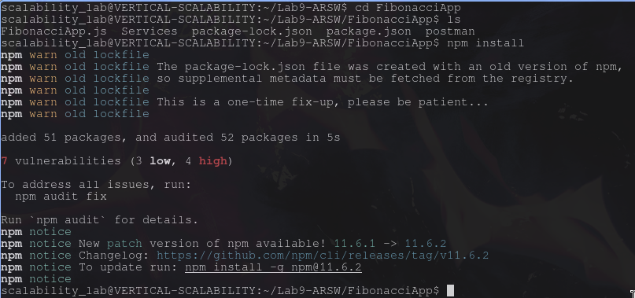

5. Para ejecutar la aplicación puede usar el comando `npm FibinacciApp.js`, sin embargo una vez pierda la conexión ssh la aplicación dejará de funcionar. Para evitar ese compartamiento usaremos *forever*. Ejecute los siguientes comando dentro de la VM.

    ` node FibonacciApp.js`

6. Antes de verificar si el endpoint funciona, en Azure vaya a la sección de *Networking* y cree una *Inbound port rule* tal como se muestra en la imágen. Para verificar que la aplicación funciona, use un browser y user el endpoint `http://xxx.xxx.xxx.xxx:3000/fibonacci/6`. La respuesta debe ser `The answer is 8`.


Para realizar este paso, nos dirigimos a la sección correspondiente en Azure y configuramos la regla de entrada diligenciando cada uno de los campos con la información indicada en las instrucciones.


Luego abrimos el navegador y accedimos a la URL usando la IP pública junto con el puerto 3000, llamando al endpoint de la aplicación y enviando el número que deseábamos evaluar.

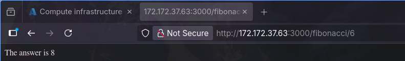

7. La función que calcula en enésimo número de la secuencia de Fibonacci está muy mal construido y consume bastante CPU para obtener la respuesta. Usando la consola del Browser documente los tiempos de respuesta para dicho endpoint usando los siguintes valores:
    * 1000000 - 16.01 s
    * 1010000 - 16.34 s
    * 1020000 - 16.56 s
    * 1030000 - 16.92 s
    * 1040000 - 17.38 s
    * 1050000 - 19.31 s
    * 1060000 - 18.27 s
    * 1070000 - 18.64 s
    * 1080000 - 18.93 s
    * 1090000 - 19.27 s

8. Dírijase ahora a Azure y verifique el consumo de CPU para la VM. (Los resultados pueden tardar 5 minutos en aparecer).


Pudimos observar el monitoreo de la infraestructura y el consumo de recursos en Azure en la siguiente imagen:


9. Ahora usaremos Postman para simular una carga concurrente a nuestro sistema. Siga estos pasos.
    * Instale newman con el comando `npm install newman -g`. Para conocer más de Newman consulte el siguiente [enlace](https://learning.getpostman.com/docs/postman/collection-runs/command-line-integration-with-newman/).
    * Diríjase hasta la ruta `FibonacciApp/postman` en una maquina diferente a la VM.
    * Para el archivo `[ARSW_LOAD-BALANCING_AZURE].postman_environment.json` cambie el valor del parámetro `VM1` para que coincida con la IP de su VM.
    * Ejecute el siguiente comando.

    ```
    newman run ARSW_LOAD-BALANCING_AZURE.postman_collection.json -e [ARSW_LOAD-BALANCING_AZURE].postman_environment.json -n 10 &
    newman run ARSW_LOAD-BALANCING_AZURE.postman_collection.json -e [ARSW_LOAD-BALANCING_AZURE].postman_environment.json -n 10
    ```


Instalamos newman con el comando:


Modificamos el archivo, para que este dirigido a nuestra ip:

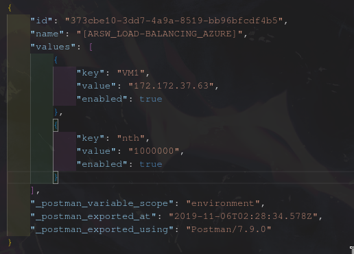

Ejecutamos:

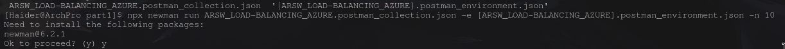

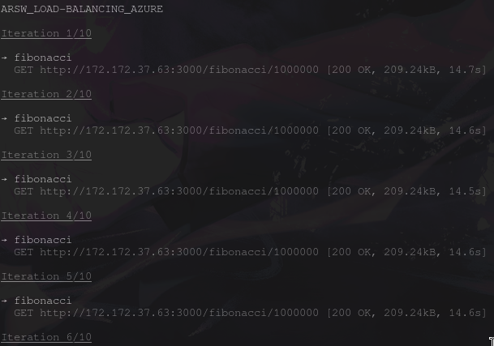

Y conseguimos los resultados:


10. La cantidad de CPU consumida es bastante grande y un conjunto considerable de peticiones concurrentes pueden hacer fallar nuestro servicio. Para solucionarlo usaremos una estrategia de Escalamiento Vertical. En Azure diríjase a la sección *size* y a continuación seleccione el tamaño `B2ms`.


Seleccionamos el tamaño indicado y reajustamos la máquina virtual para aplicar el nuevo nivel de capacidad.

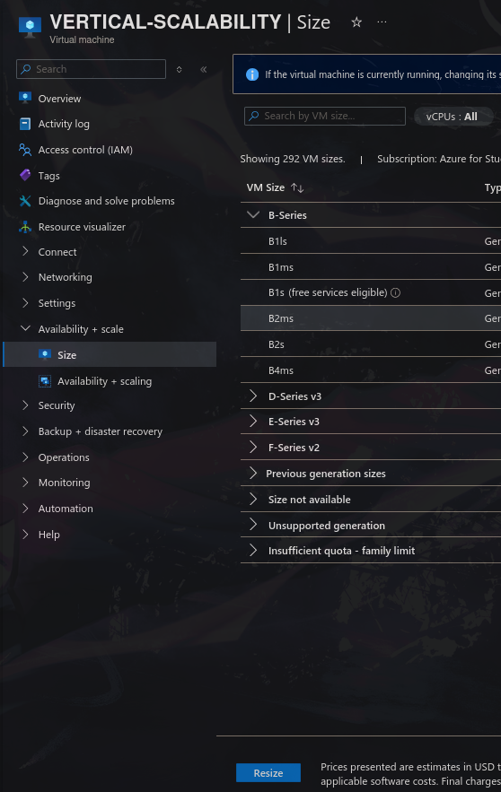

11. Una vez el cambio se vea reflejado, repita el paso 7, 8 y 9.

Los nuevos tiempos de respuesta fueron:

    * 1000000 - 12.40 s
    * 1010000 - 10.66 s
    * 1020000 - 10.93 s
    * 1030000 - 11.12 s
    * 1040000 - 11.56 s
    * 1050000 - 11.51 s
    * 1060000 - 11.68 s
    * 1070000 - 11.90 s
    * 1080000 - 12.15 s
    * 1090000 - 12.47 s

El nuevo consumo de recursos (cabe aclarar que la primer curva sigue siendo de la primera de ejecucion, no de esta segunda):

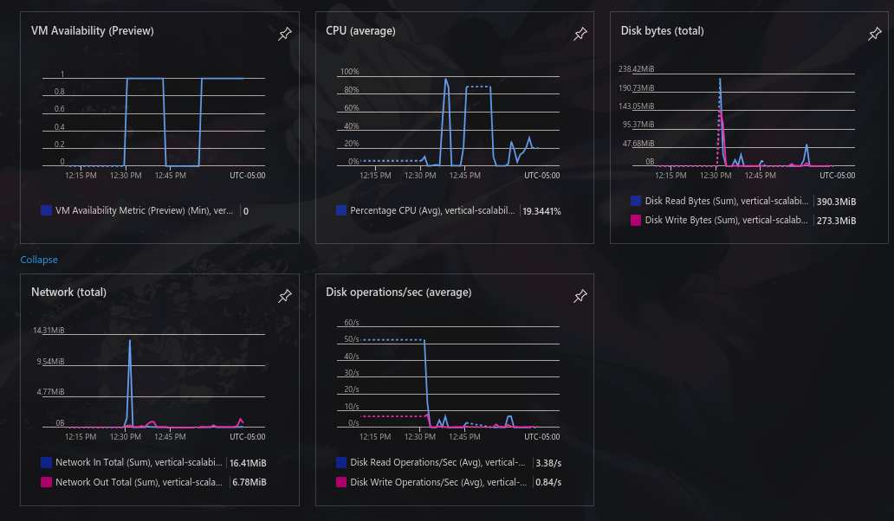

Y finalmente los resultados al ejecutar fueron:


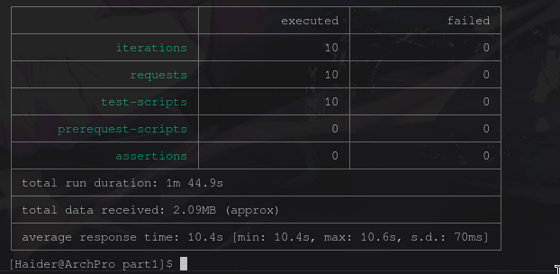

12. Evalue el escenario de calidad asociado al requerimiento no funcional de escalabilidad y concluya si usando este modelo de escalabilidad logramos cumplirlo.

Al evaluar el escenario de calidad asociado al requerimiento de escalabilidad, analizamos el comportamiento de la aplicación antes y después del escalamiento vertical. En la máquina `B1ls` observamos tiempos de respuesta altos y un consumo de CPU cercano al 100% cuando realizamos peticiones concurrentes, lo que evidenciaba que la capacidad inicial no era suficiente para soportar la carga.

Tras aumentar el tamaño de la VM a B2ms, los tiempos de respuesta mejoraron notablemente y el uso de CPU disminuyó durante las pruebas, mostrando un rendimiento más estable y una mejor capacidad para atender solicitudes concurrentes.

Esto nos permitió concluir que el escalamiento vertical sí mejoró el rendimiento y ayudó a cumplir parcialmente el requerimiento de escalabilidad, al menos para la carga evaluada.

13. Vuelva a dejar la VM en el tamaño inicial para evitar cobros adicionales.

**Preguntas**

1. ¿Cuántos y cuáles recursos crea Azure junto con la VM?
2. ¿Brevemente describa para qué sirve cada recurso?

| Recurso                          | Tipo                    | ¿Para qué sirve?                                                                                                                      |
| -------------------------------- | ----------------------- | ------------------------------------------------------------------------------------------------------------------------------------- |
| **scalability_lab_KEY**          | SSH Key                 | Clave pública SSH utilizada para conectarnos de manera segura a la VM.                                                                |
| **VERTICAL-SCALABILITY**         | Virtual Machine         | Máquina virtual donde se ejecuta la aplicación de Node.js.                                                                            |
| **VERTICAL-SCALABILITY-ip**      | Public IP Address       | Dirección IP pública que permite el acceso a la VM desde Internet.                                                                    |
| **VERTICAL-SCALABILITY-nsg**     | Network Security Group  | Firewall que define qué tráfico puede entrar o salir de la VM; por ejemplo, permite habilitar el puerto 3000 para nuestra aplicación. |
| **VERTICAL-SCALABILITY-vnet**    | Virtual Network (VNet)  | Red privada virtual donde reside la VM; permite comunicación interna entre recursos sin exponerlos.                                   |
| **vertical-scalability851**      | Network Interface (NIC) | Interfaz de red que conecta la VM con la VNet; funciona como su “tarjeta de red”.                                                     |
| **VERTICAL-SCALABILITY_OsDisk…** | Disk                    | Disco virtual que contiene el sistema operativo (Ubuntu).                                                                             |


3. ¿Al cerrar la conexión ssh con la VM, por qué se cae la aplicación que ejecutamos con el comando `npm FibonacciApp.js`? ¿Por qué debemos crear un *Inbound port rule* antes de acceder al servicio?

Cuando ejecutamos npm FibonacciApp.js desde la consola SSH, el proceso queda ligado a esa sesión. Por eso, si cerramos la terminal o se cae la conexión, la aplicación se detiene. Para evitarlo normalmente se usan herramientas como pm2, forever o nohup, que permiten mantener la app corriendo en segundo plano.

Sobre el puerto: las VMs de Azure bloquean todo el tráfico entrante por defecto. Solo funcionan los puertos que abrimos manualmente en el Network Security Group (NSG). Como la app usa el puerto 3000, necesitamos crear una regla de entrada para habilitarlo; de lo contrario, el navegador o Postman no podrán conectarse.

4. Adjunte tabla de tiempos e interprete por qué la función tarda tando tiempo.

Máquina B1ls

| Input     | Tiempo (s) |
| --------- | ---------- |
| 1,000,000 | 16.01      |
| 1,010,000 | 16.34      |
| 1,020,000 | 16.56      |
| 1,030,000 | 16.92      |
| 1,040,000 | 17.38      |
| 1,050,000 | 19.31      |
| 1,060,000 | 18.27      |
| 1,070,000 | 18.64      |
| 1,080,000 | 18.93      |
| 1,090,000 | 19.27      |

Máquina B2ms

| Input     | Tiempo (s) |
| --------- | ---------- |
| 1,000,000 | 12.73      |
| 1,010,000 | 12.89      |
| 1,020,000 | 12.97      |
| 1,030,000 | 13.18      |
| 1,040,000 | 13.80      |
| 1,050,000 | 13.94      |
| 1,060,000 | 14.07      |
| 1,070,000 | 14.67      |
| 1,080,000 | 14.70      |
| 1,090,000 | 15.16      |


La función tarda tanto porque el algoritmo es extremadamente ineficiente:

- La implementación típica de Fibonacci recursivo es O(2ⁿ).

- Para números como 1,000,000 las operaciones explotan.

- La CPU se ve obligada a realizar millones de llamadas recursivas.

La B1ls se satura rápidamente porque solo tiene 1 vCPU.
5. Adjunte imágen del consumo de CPU de la VM e interprete por qué la función consume esa cantidad de CPU.

En B1ls (1 vCPU)


- El CPU llega cerca del 100% constantemente.

- La máquina no tiene suficiente capacidad para este tipo de cálculo.

- Se agotan los créditos de CPU (por ser una instancia burstable).

- La VM queda limitada y responde lentamente.

En B2ms (2 vCPUs)


- El consumo cae a ~35%.

- La aplicación tiene espacio suficiente para operar.

- La curva es más estable y menos agresiva.

- Los créditos de CPU duran más y se recuperan más rápido.

6. Adjunte la imagen del resumen de la ejecución de Postman. Interprete:
    * Tiempos de ejecución de cada petición.
    * Si hubo fallos documentelos y explique.


Tiempos de ejecución

- En B1ls, los tiempos son muy altos e inestables.

- En B2ms, los tiempos disminuyeron y fueron más consistentes.

no hubo fallos

7. ¿Cuál es la diferencia entre los tamaños `B2ms` y `B1ls` (no solo busque especificaciones de infraestructura)?

Uso previsto

- B1ls: cargas extremadamente ligeras, pruebas simples.

- B2ms: aplicaciones web, APIs, workloads más reales.

Manejo de créditos de CPU

- B1ls gasta créditos muy rápido → queda limitada.

- B2ms tiene más créditos y mejor recuperación → mayor estabilidad.

Estabilidad bajo carga

- B1ls sufre degradación inmediata.

- B2ms soporta cargas constantes sin degradarse.

8. ¿Aumentar el tamaño de la VM es una buena solución en este escenario?, ¿Qué pasa con la FibonacciApp cuando cambiamos el tamaño de la VM?

Al cambiar de una máquina B1ls (1 vCPU, 0.5 GB RAM) a una B2ms (2 vCPU, 8 GB RAM), se notó una mejora evidente en el tiempo de ejecución de la función Fibonacci y un uso del CPU más estable. Para el mismo rango de pruebas (1,000,000 a 1,090,000), los tiempos bajaron de un promedio de 17.5 s en la B1ls a aproximadamente 13.5 s en la B2ms. Esto demuestra que la función sí aprovecha una mayor capacidad de procesamiento y memoria.

Sin embargo, aunque aumentar los recursos de la VM mejora el rendimiento, esta estrategia tiene límites: si el código no está optimizado para escalar, agregar más hardware termina siendo una solución costosa y poco eficiente.

9. ¿Qué pasa con la infraestructura cuando cambia el tamaño de la VM? ¿Qué efectos negativos implica?

Cambiar el tamaño de una VM afecta la infraestructura en varios aspectos:

- Costo: Pasar de una B1ls a una B2ms incrementa considerablemente el precio. Esto puede volverse muy costoso si se escala a varias máquinas o si se mantiene durante largos periodos.

- Uso de recursos: Una VM más grande demanda más capacidad del proveedor (Azure), lo que impacta la planificación del presupuesto y los límites de la suscripción.

- Interrupciones: El cambio de tamaño suele requerir reiniciar la VM, lo que implica un tiempo de inactividad si no se coordina bien.

- Sobreaprovisionamiento: Si la carga no necesita tantos recursos, se termina pagando por capacidad que no se utiliza, lo cual no es eficiente.

10. ¿Hubo mejora en el consumo de CPU o en los tiempos de respuesta? Si/No ¿Por qué?

Sí, hubo mejoras tanto en el uso del CPU como en los tiempos de respuesta, y se explica de la siguiente manera:

Consumo de CPU:

En la VM B1ls, el procesador trabajaba casi al límite, con un uso del 97.32%, señal clara de saturación.

En la B2ms, el uso bajó a 8menos del 40%, mostrando que la máquina tiene suficiente capacidad adicional para manejar la carga sin problemas y, potencialmente, atender más solicitudes simultáneas.

Tiempos de respuesta:

Promedio en B1ls: 14.6 s

Promedio en B2ms: 10.4 s

11. Aumente la cantidad de ejecuciones paralelas del comando de postman a `4`. ¿El comportamiento del sistema es porcentualmente mejor?

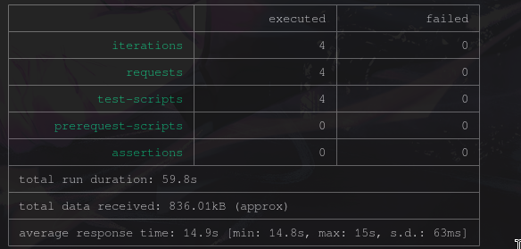

Al reducir la cantidad de ejecuciones paralelas vemos que el resultado del tiempo sigue siendo casi el mismo sin haber una notable diferencia.

### Parte 2 - Escalabilidad horizontal

#### Crear el Balanceador de Carga

Antes de continuar puede eliminar el grupo de recursos anterior para evitar gastos adicionales y realizar la actividad en un grupo de recursos totalmente limpio.

1. El Balanceador de Carga es un recurso fundamental para habilitar la escalabilidad horizontal de nuestro sistema, por eso en este paso cree un balanceador de carga dentro de Azure tal cual como se muestra en la imágen adjunta.


2. A continuación cree un *Backend Pool*, guiese con la siguiente imágen.


3. A continuación cree un *Health Probe*, guiese con la siguiente imágen.


4. A continuación cree un *Load Balancing Rule*, guiese con la siguiente imágen.


5. Cree una *Virtual Network* dentro del grupo de recursos, guiese con la siguiente imágen.


#### Crear las maquinas virtuales (Nodos)

Ahora vamos a crear 3 VMs (VM1, VM2 y VM3) con direcciones IP públicas standar en 3 diferentes zonas de disponibilidad. Después las agregaremos al balanceador de carga.

1. En la configuración básica de la VM guíese por la siguiente imágen. Es importante que se fije en la "Avaiability Zone", donde la VM1 será 1, la VM2 será 2 y la VM3 será 3.


2. En la configuración de networking, verifique que se ha seleccionado la *Virtual Network*  y la *Subnet* creadas anteriormente. Adicionalmente asigne una IP pública y no olvide habilitar la redundancia de zona.


3. Para el Network Security Group seleccione "avanzado" y realice la siguiente configuración. No olvide crear un *Inbound Rule*, en el cual habilite el tráfico por el puerto 3000. Cuando cree la VM2 y la VM3, no necesita volver a crear el *Network Security Group*, sino que puede seleccionar el anteriormente creado.


4. Ahora asignaremos esta VM a nuestro balanceador de carga, para ello siga la configuración de la siguiente imágen.


5. Finalmente debemos instalar la aplicación de Fibonacci en la VM. para ello puede ejecutar el conjunto de los siguientes comandos, cambiando el nombre de la VM por el correcto

```
git clone https://github.com/daprieto1/ARSW_LOAD-BALANCING_AZURE.git

curl -o- https://raw.githubusercontent.com/creationix/nvm/v0.34.0/install.sh | bash
source /home/vm1/.bashrc
nvm install node

cd ARSW_LOAD-BALANCING_AZURE/FibonacciApp
npm install

npm install forever -g
forever start FibonacciApp.js
```

Realice este proceso para las 3 VMs, por ahora lo haremos a mano una por una, sin embargo es importante que usted sepa que existen herramientas para aumatizar este proceso, entre ellas encontramos Azure Resource Manager, OsDisk Images, Terraform con Vagrant y Paker, Puppet, Ansible entre otras.

#### Probar el resultado final de nuestra infraestructura

1. Porsupuesto el endpoint de acceso a nuestro sistema será la IP pública del balanceador de carga, primero verifiquemos que los servicios básicos están funcionando, consuma los siguientes recursos:

```
http://52.155.223.248/
http://52.155.223.248/fibonacci/1
```

2. Realice las pruebas de carga con `newman` que se realizaron en la parte 1 y haga un informe comparativo donde contraste: tiempos de respuesta, cantidad de peticiones respondidas con éxito, costos de las 2 infraestrucruras, es decir, la que desarrollamos con balanceo de carga horizontal y la que se hizo con una maquina virtual escalada.

3. Agregue una 4 maquina virtual y realice las pruebas de newman, pero esta vez no lance 2 peticiones en paralelo, sino que incrementelo a 4. Haga un informe donde presente el comportamiento de la CPU de las 4 VM y explique porque la tasa de éxito de las peticiones aumento con este estilo de escalabilidad.

```
newman run ARSW_LOAD-BALANCING_AZURE.postman_collection.json -e [ARSW_LOAD-BALANCING_AZURE].postman_environment.json -n 10 &
newman run ARSW_LOAD-BALANCING_AZURE.postman_collection.json -e [ARSW_LOAD-BALANCING_AZURE].postman_environment.json -n 10 &
newman run ARSW_LOAD-BALANCING_AZURE.postman_collection.json -e [ARSW_LOAD-BALANCING_AZURE].postman_environment.json -n 10 &
newman run ARSW_LOAD-BALANCING_AZURE.postman_collection.json -e [ARSW_LOAD-BALANCING_AZURE].postman_environment.json -n 10
```

**Preguntas**

* ¿Cuáles son los tipos de balanceadores de carga en Azure y en qué se diferencian?, ¿Qué es SKU, qué tipos hay y en qué se diferencian?, ¿Por qué el balanceador de carga necesita una IP pública?
* ¿Cuál es el propósito del *Backend Pool*?
* ¿Cuál es el propósito del *Health Probe*?
* ¿Cuál es el propósito de la *Load Balancing Rule*? ¿Qué tipos de sesión persistente existen, por qué esto es importante y cómo puede afectar la escalabilidad del sistema?.
* ¿Qué es una *Virtual Network*? ¿Qué es una *Subnet*? ¿Para qué sirven los *address space* y *address range*?
* ¿Qué son las *Availability Zone* y por qué seleccionamos 3 diferentes zonas?. ¿Qué significa que una IP sea *zone-redundant*?
* ¿Cuál es el propósito del *Network Security Group*?
* Informe de newman 1 (Punto 2)
* Presente el Diagrama de Despliegue de la solución.


